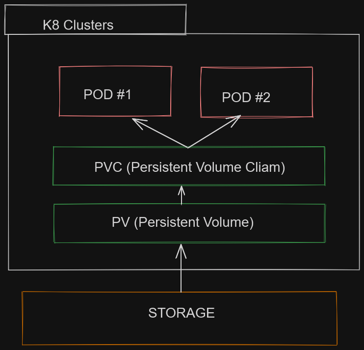

# Project Documentation: Editing Deployments, Horizontal Pod Autoscaling, and Persistent Volume

## Horizontal Pod Autoscaling (HPA)

The Horizontal Pod Autoscaler (HPA) automatically manages the scaling of your deployments based on resource utilization. It allows your application to dynamically adjust the number of replicas based on the demand it receives. To set up HPA for your deployment, follow these steps:

1. Edit and Manage Deployments:
`kubectl edit deployment <name_of_deployment>`


2. Create HPA YAML file (e.g., mongodb-asg.yml or app-hpa.yml):
```yaml
apiVersion: autoscaling/v1
kind: HorizontalPodAutoscaler
metadata:
  name: node-hpa
  namespace: default
spec:
  maxReplicas: 9 # Set the maximum number of replicas
  minReplicas: 3 # Set the minimum number of replicas
  scaleTargetRef:
    apiVersion: apps/v1
    kind: Deployment
    name: node # Replace with the name of your deployment
  targetCPUUtilizationPercentage: 50 # Set the CPU utilization percentage for scaling
```
`kubectl create -f mongodb-asg.yml`

## Persistent Volumes (PV) and Persistent Volume Claims (PVC)

In Kubernetes, PVs and PVCs work together to provide a way for your applications to store and persist data. PV is like a storage box, while PVC is the request for storage. Here's how to set up PV and PVC:




1. Create PV YAML (e.g., app-pv.yml):
```yaml

apiVersion: v1
kind: PersistentVolume
metadata:
  name: node-pv
spec:
  accessModes:
  - ReadWriteOnce
  capacity:
    storage: 1Gi # Set the storage capacity
  hostPath:
    path: /tmp/data # Set the path for the host storage
  persistentVolumeReclaimPolicy: Retain
  volumeMode: Filesystem
  storageClassName: manual

```


`kubectl create -f app-pv.yml`

2. Create PVC YAML (e.g., app-pvc.yml):
```yaml
apiVersion: v1
kind: PersistentVolumeClaim
metadata:
  name: node-pvc
spec:
  accessModes:
    - ReadWriteOnce
  resources:
    requests:
      storage: 512Mi # Set the requested storage size
  storageClassName: manual

```

`kubectl create -f app-pvc.yml`

## Update Node Deployment with PV

Now, update your Node Deployment to use the PV:
```yaml
apiVersion: apps/v1
kind: Deployment
metadata:
  name: node # Replace with the name of your deployment
spec:
  selector:
    matchLabels:
      app: node
  replicas: 3 # Set the number of replicas
  template:
    metadata:
      labels:
        app: node
    spec:
      volumes:
        - name: node-pv # Connect to PVC
          persistentVolumeClaim:
            claimName: node-pvc # Replace with the name of your PVC
      containers:
        - name: node
          image: yourid/tech241-node-app:v1 # Use your application image
          ports:
            - containerPort: 3000
          volumeMounts: # Connect to PVC
            - name: node-pv
              mountPath: /tmp/data
          env:
            - name: DB_HOST
              value: mongodb://mongo:27017/posts
          imagePullPolicy: Always

```
`kubectl apply -f node-deployment.yml``

## Multiple Object Creation

You can combine multiple object creation YAML files into one using `---`. Here's an example for MongoDB:
```yaml
apiVersion: v1
kind: PersistentVolumeClaim
metadata:
  name: mongo-multiple-db
spec:
  accessModes:
    - ReadWriteOnce
  resources:
    requests:
      storage: 256Mi
---
apiVersion: autoscaling/v1
kind: HorizontalPodAutoscaler
metadata:
  name: mongo-multiple-hpa
  namespace: default
spec:
  maxReplicas: 9
  minReplicas: 1
  scaleTargetRef:
    apiVersion: apps/v1
    kind: Deployment
    name: mongo-multiple
  targetCPUUtilizationPercentage: 50
---
apiVersion: apps/v1
kind: Deployment
metadata:
  name: mongo-multiple
spec:
  selector:
    matchLabels:
      app: mongo-multiple
  replicas: 1
  template:
    metadata:
      labels:
        app: mongo-multiple
    spec:
      containers:
        - name: mongo-multiple
          image: urid/tech241-mongodb:v1
          ports:
            - containerPort: 27017
          volumeMounts:
            - name: storage-multiple
              mountPath: /data/db
      volumes:
        - name: storage-multiple
          persistentVolumeClaim:
            claimName: mongo-multiple-db
---
apiVersion: v1
kind: Service
metadata:
  name: mongo-multiple
spec:
  selector:
    app: mongo-multiple
  ports:
    - port: 27017
      targetPort: 27017

```
apply it:

```bash
$ kubectl create -f mongo-multiple-object.yml

persistentvolumeclaim/mongo-multiple-db created
horizontalpodautoscaler.autoscaling/mongo-multiple-hpa created
deployment.apps/mongo-multiple created
service/mongo-multiple created
```