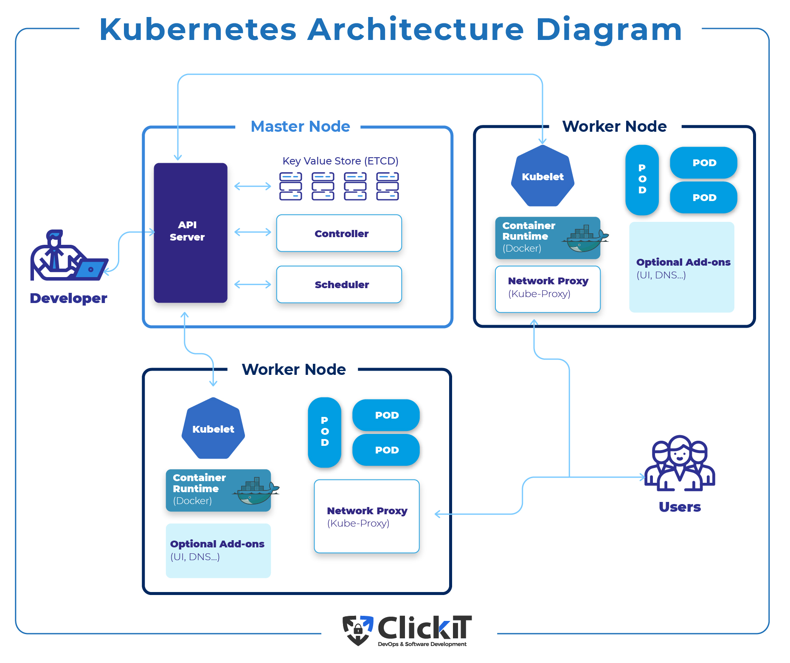

# Kubernetes (K8s) - An Introduction for Non-Technical Users

## What is Kubernetes (K8s)?
- Open-source container orchestration platform.
- Automates deployment, scaling, and management of containerized applications.
- Ensures applications run consistently across different environments.
  ## Kubernetes Architecture Diagram

## Why Should We Learn and Use Kubernetes?
- Simplified application deployment.
- Effortless scaling based on demand.
- High availability and resilience.
- Declarative configuration for reducing manual intervention.
- Resource efficiency and optimization.

## Who is Using Kubernetes?
- Widely adopted by startups, enterprises, and cloud providers.
- Used by Google, Microsoft, AWS, Netflix, Spotify, and more.

## Benefits of Kubernetes for Businesses:
- Cost savings through optimized resource utilization.
- Seamless scalability to handle increased workloads.
- Improved resource efficiency and performance.
- Faster application deployment and time-to-market.
- High availability and reliable service delivery.

## Understanding Kubernetes Objects:
- **Pods**: Smallest unit, represents a running process, contains one or more containers.
- **Deployments**: Define desired state for Pods and ReplicaSets, enable easy updates and rollbacks.
- **Services**: Provide stable network endpoint for accessing Pods, enable load balancing and service discovery.
- **ReplicaSets**: Ensure specified number of identical Pods are running, automatic scaling and recovery.

## Concept of Labels and Selectors in Kubernetes:
- Labels: Key-value pairs attached to Kubernetes objects.
- Selectors: Filter and query objects based on labels.
- Enables flexible grouping, monitoring, and management of Kubernetes objects.